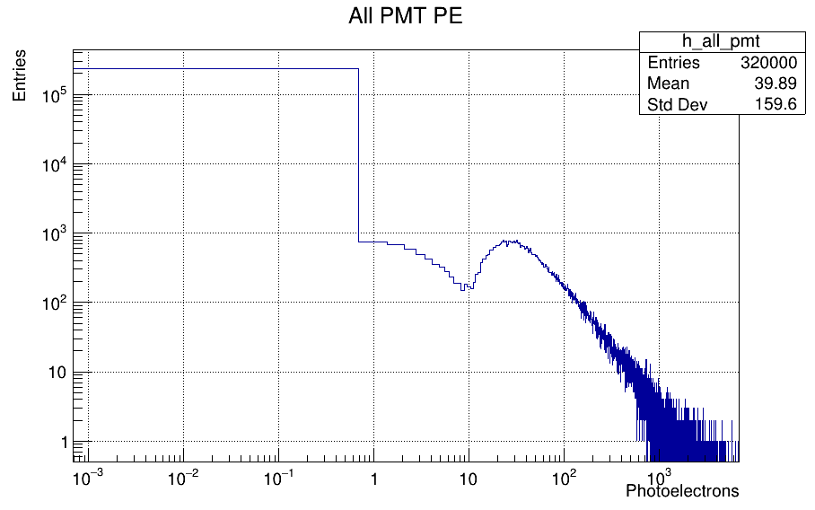
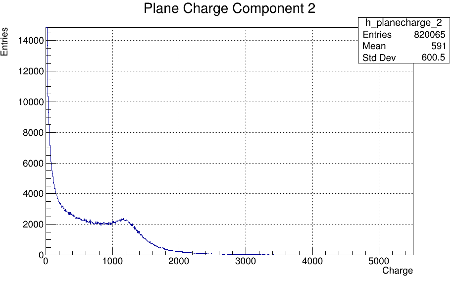
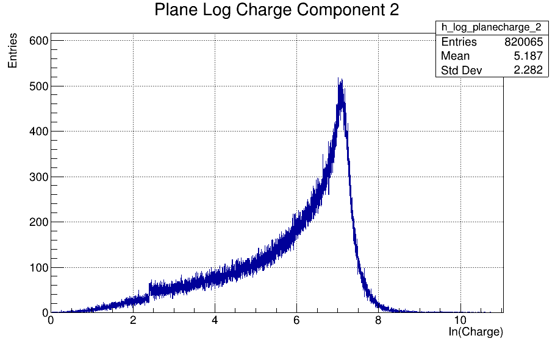

# Example Data Distributions

This document shows key data distributions from the FlashMatch training dataset, generated using `calculate_means_vars.py`.

**Dataset**: Partial sample of `mcc9_v29e_dl_run3_G1_extbnb_dlana` data set processed on Tufts cluster.

---

## PMT Photoelectron Distributions

### All PMT PE Distribution (Log-Log Scale)

The target values for the neural network loss function show a heavy-tailed distribution typical of photon counting statistics:



### Recommendations for Network Training

Given this distribution, a **log(1.0 + PE) transformation** is recommended for training stability.

### Log-Transformed PMT PE Distribution

After applying the log transformation, the distribution becomes more manageable for neural network training:


**Normalization Parameters**: 
- **Offset**: 3.6
- **Scale**: 5.0

The normalized values will be: `(log(1.0 + pe) - 3.6) / 5.0`

---

## Voxel Charge Distributions

### Raw Charge Distribution (Y-Plane)

The charge deposition in individual voxels also follows a heavy-tailed distribution:



### Log-Transformed Charge Distribution (Y-Plane)

Similar to PMT PE, applying **log(1.0 + charge)** transformation improves the distribution for ML training:



**Normalization Parameters (Y-Plane)**:
- **Offset**: -7.2  
- **Scale**: 7.2

The normalized charge values will be: `(log(1.0 + charge) + 7.2) / 7.2`

---

## Key Insights

1. **Heavy-Tailed Distributions**: Both PMT PE and voxel charge follow power-law-like distributions typical of energy deposition processes.

2. **Log Transformation Benefits**: 
   - Reduces dynamic range from ~4-5 orders of magnitude to ~1-2 orders
   - Stabilizes gradients during neural network training
   - Better handles the many small values and few large values

3. **Normalization Strategy**:
   - Apply log transformation first: `log(1.0 + value)`
   - Then standardize: `(log_value - offset) / scale`
   - Results in approximately zero-mean, unit-variance distributions

4. **Training Implications**:
   - Use these transformations in data preprocessing
   - Consider Poisson or negative binomial loss functions for the raw PE space
   - Monitor for numerical stability with very small PE values

---

## Usage in Training

```python
import numpy as np

def preprocess_pmt_pe(pe_values):
    """Apply log transformation and normalization to PMT PE values"""
    log_pe = np.log(1.0 + pe_values)
    return (log_pe - 3.6) / 5.0

def preprocess_charge_y(charge_values):
    """Apply log transformation and normalization to Y-plane charge"""
    log_charge = np.log(1.0 + charge_values)
    return (log_charge + 7.2) / 7.2

# Example usage in data loader
normalized_pe = preprocess_pmt_pe(batch['observed_pe_per_pmt'])
normalized_charge = preprocess_charge_y(batch['planecharge'][:, :, 2])  # Y-plane
```

---

## Statistical Summary

These normalizations aim to promote stable training dynamics and consistent convergence across different network architectures.

